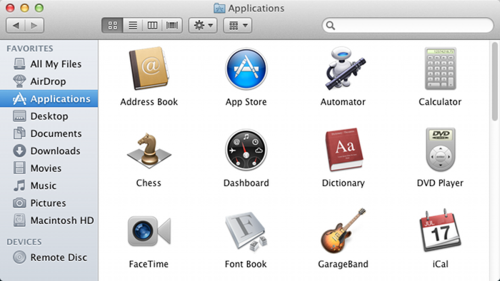

##文件和文件夹

一个文件是作为一个单元名称与存储的数据的集合。现代操作系统 （如 Windows 或 Mac OSX） 包含数以百万计的存储大量各种不同类型的信息 — — 一切文本文档到多媒体文件和可执行程序文件。
    
所有文件存储于计算机上都用相同的方式： 他们都有一个名称、 确定的大小 （以字节为单位） 和有关联的类型->通常由文件扩展名区别 — — 在文件名最后一个`.`之后的部分表示文件的类型...例如名称为 `hello.txt` 文件的扩展名 txt，用来表示文本数据文件。

文件夹（也称为目录）是用来组合多个文件在一起的文件。他们还可以包含其他文件夹。在 Windows 上，文件和文件夹的路径 (位置) 用字符`\` （反斜杠）分隔，例如：`C:\Users\john\example.txt`。`example.txt`这个文件它包含在文件夹john，john本身包含在文件夹存储在驱动器 C （在代表的主要物理硬盘，在 Windows 中）。OSX （和大多数其他操作系统） 对文件和文件夹的路径用字符`/`（正斜杠）分隔，例如：`/Users/john/example.txt`。和 Windows 上 example.txt 的文件一样，它被包含在文件夹john，这是在用户文件夹中。与windows不同，OSX 不指定该文件的存储位置的驱动器号。

###Windows

在 Windows 上浏览文件和文件夹可以使用 Windows 资源管理器 （可通过双击"我的电脑"或键入 win + e）:

###OSX

在 OSX 上l浏览的文件和文件夹可以使用查找程序（可通过单击查找程序图标 — — 在左边栏中较低的显示图标）：

