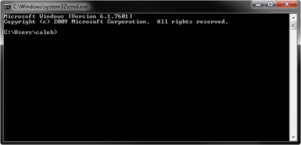

##终端

我们今天与计算机的交互大多数是通过复杂的图形用户界面 (GUIs)。我们使用键盘、 鼠标和触摸屏与显示的按钮或其他类型的屏幕显示控件进行交互。

它并不总是这样。在 GUI 之前我们有终端 — 一个简单的文本界面来发出的命令和收到的答复来与计算机对话，而不是操纵屏幕上的按钮。

尽管它可能是大多数计算机世界上作为过去的遗迹而保留终端，事实上，终端仍然是在大多数计算机上的大多数编程语言所使用的基本用户界面。Go编程语言也没有什么不同，所以我们编写一个程序，在编写Go之前我们需要基本理解终端的工作原理。

###Windows

在 Windows 终端 （也称为命令行） 的可以通过键入 windows 键 + r （按住 windows 键，然后按 r 键），输入 cmd.exe，点击回车。您应该看到一个黑色窗口出现，看起来像这样：

默认情况下命令行启动您进入主目录中。（对我来说这是 `C:\Users\caleb`）你通过键盘发出命令击球输入。请尝试输入命令 `dir`，列出目录的内容。您应该看到底是这样：

    C:\Users\caleb>dir
     Volume in drive C has no label.
     Volume Serial Number is B2F5-F125

它会列出您的主目录中的文件和文件夹。您可以通过使用命令 `cd` 更改目录。例如，您可能有一个名为桌面文件夹。您可以通过输入 `cd 桌面`，然后输入目录查看其内容,若要返回到您的主目录可以使用特殊的目录名称`..`(彼此相邻的两个句点）： `cd ..`单个句点表示当前文件夹 （称为工作文件夹），所以`cd .`。不会做任何事情。有更多的命令您可以使用，但这应该足以帮助您入门。

###OSX

 OSX 终端可以通过 Finder → Applications → Utilities → Terminal（查找器 → 应用程序 → 实用工具 → 终端）开启终端。您应该看到一个像这样的窗口：

默认情况下终端启动在您的主目录中。（对我来说这是 /Users/caleb）你通过键盘发出命令和击球回车。尝试输入命令 ls，其中列出目录的内容。您应该看到这样的事：

    caleb-min:~ caleb$ ls
     Desktop      Downloads      Movies     Pictures
     Documents    Library        Music      Public

这些文件和文件夹包含在您的主目录中 （在上面情况下没有任何文件）。您可以更改目录使用 cd 命令。例如，您可能有一个名为`桌面`的文件夹。您可以通过输入 `cd 桌面`，然后键入 `ls` 看到其内容。若要返回到您的主目录可以使用特殊的目录名称`..`(彼此相邻的两个句点）： `cd .`单个句点表示当前文件夹 （称为工作文件夹），所以`cd .`不会做任何事情。有更多的命令，您可以使用，但这应该足以帮助您入门。