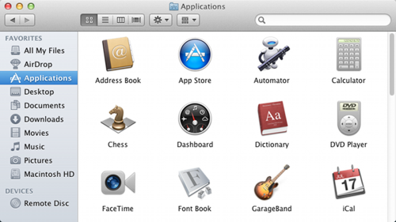
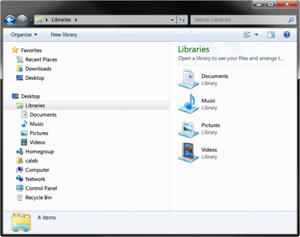

##Files and Folders

A file is a collection of data stored as a unit with a name. Modern operating systems (like Windows or Mac OSX) contain millions of files which store a large variety of different types of information – everything from text documents to executable programs to multimedia files.

All files are stored in the same way on a computer: they all have a name, a definite size (measured in bytes) and an associated type. Typically the file's type is signified by the file's extension – the part of the file name that comes after the last .. For example a file with the name hello.txt has the extension txt which is used to represent textual data.

Folders (also called directories) are used to group files together. They can also contain other folders. On Windows file and folder paths (locations) are represented with the \ (backslash) character, for example: C:\Users\john\example.txt. example.txt is the file name, it is contained in the folder john, which is itself contained in the folder Users which is stored on drive C (which represents the primary physical hard drive in Windows). On OSX (and most other operating systems) file and folder paths are represented with the / (forward slash) character, for example: /Users/john/example.txt. Like on Windows example.txt is the file name, it is contained in the folder john, which is in the folder Users. Unlike Windows, OSX does not specify a drive letter where the file is stored.

###Windows

On Windows files and folders can be browsed using Windows Explorer (accessible by double-clicking “My Computer” or typing win+e):

###OSX

On OSX files and folders can be browsed using Finder (accessible by clicking the Finder icon – the face icon in the lower left bar):

## links
   * [preface](<preface.md>)
   * pre: [Getting Started](<01.0.md>)
   * next: [The Terminal](<01.2.md>)