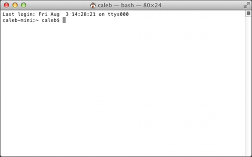

##The Terminal

Most of the interactions we have with computers today are through sophisticated graphical user interfaces (GUIs). We use keyboards, mice and touchscreens to interact with visual buttons or other types of controls that are displayed on a screen.

It wasn't always this way. Before the GUI we had the terminal – a simpler textual interface to the computer where rather than manipulating buttons on a screen we issued commands and received replies. We had a conversation with the computer.

And although it might appear that most of the computing world has left behind the terminal as a relic of the past, the truth is that the terminal is still the fundamental user interface used by most programming languages on most computers. The Go programming language is no different, and so before we write a program in Go we need to have a rudimentary understanding of how a terminal works.

###Windows

In Windows the terminal (also known as the command line) can be brought up by typing the windows key + r (hold down the windows key then press r), typing cmd.exe and hitting enter. You should see a black window appear that looks like this:

By default the command line starts in your home directory. (In my case this is C:\Users\caleb) You issue commands by typing them in and hitting enter. Try entering the command dir, which lists the contents of a directory. You should see something like this:

    C:\Users\caleb>dir
     Volume in drive C has no label.
     Volume Serial Number is B2F5-F125

Followed by a list of the files and folders contained in your home directory. You can change directories by using the command cd. For example you probably have a folder called Desktop. You can see its contents by entering cd Desktop and then entering dir. To go back to your home directory you can use the special directory name .. (two periods next to each other): cd ... A single period represents the current folder (known as the working folder), so cd . doesn't do anything. There are a lot more commands you can use, but this should be enough to get you started.

###OSX

In OSX the terminal can be reached by going to Finder → Applications → Utilities → Terminal. You should see a window like this:

By default the terminal starts in your home directory. (In my case this is /Users/caleb) You issue commands by typing them in and hitting enter. Try entering the command ls, which lists the contents of a directory. You should see something like this:

    caleb-min:~ caleb$ ls
     Desktop      Downloads      Movies     Pictures
     Documents    Library        Music      Public

These are the files and folders contained in your home directory (in this case there are no files). You can change directories using the cd command. For example you probably have a folder called Desktop. You can see its contents by entering cd Desktop and then entering ls. To go back to your home directory you can use the special directory name .. (two periods next to each other): cd ... A single period represents the current folder (known as the working folder), so cd . doesn't do anything. There are a lot more commands you can use, but this should be enough to get you started.

## links
   * [preface](<preface.md>)
   * pre: [Files and Folders](<01.1.md>)
   * next: [Text Editors](<01.3.md>)