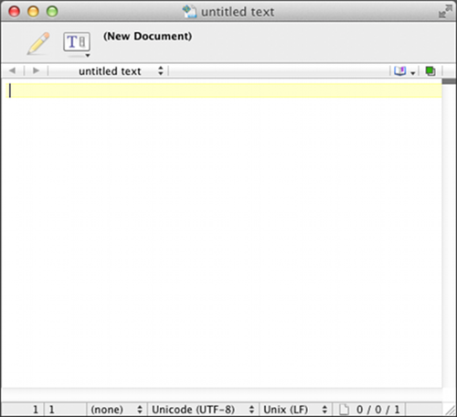

##Text Editors

The primary tool programmers use to write software is a text editor. Text editors are similar to word processing programs (Microsoft Word, Open Office, …) but unlike such programs they don't do any formatting, (No bold, italic, …) instead they operate only on plain text. Both OSX and Windows come with text editors but they are highly limited and I recommend installing a better one.

To make the installation of this software easier an installer is available at the book's website: http://www.golang-book.com/. This installer will install the Go tool suite, setup environmental variables and install a text editor.

###Windows

For windows the installer will install the Scite text editor. You can open it by going to Start → All Programs → Go → Scite. You should see something like this:

The text editor contains a large white text area where text can be entered. To the left of this text area you can see the line numbers. At the bottom of the window is a status bar which displays information about the file and your current location in it (right now it says that we are on line 1, column 1, text is being inserted normally, and we are using windows-style newlines).

You can open files by going to File → Open and browsing to your desired file. Files can be saved by going to File → Save or File → Save As.

As you work in a text editor it is useful to learn keyboard shortcuts. The menus list the shortcuts to their right. Here are a few of the most common:

* Ctrl + S – save the current file
* Ctrl + X – cut the currently selected text (remove it and put it in your clipboard so it can be pasted later)
*  Ctrl + C – copy the currently selected text
*  Ctrl + V – paste the text currently in the clipboard
*  Use the arrow keys to navigate, Home to go to the beginning of the line and End to go to the end of the line
*  Hold down shift while using the arrow keys (or Home and End) to select text without using the mouse
*  Ctrl + F – brings up a find in file dialog that you can use to search the contents of a file

###OSX

For OSX the installer installs the Text Wrangler text editor:

Like Scite on Windows Text Wrangler contains a large white area where text is entered. Files can be opened by going to File → Open. Files can be saved by going to File → Save or File → Save As. Here are some useful keyboard shortcuts: (Command is the ⌘ key)

* Command + S – save the current file
* Command + X – cut the currently selected text (remove it and put it in your clipboard so it can be pasted later)
* Command + C – copy the currently selected text
* Command + V – paste the text currently in the clipboard
*  Use the arrow keys to navigate
*  Command + F – brings up a find in file dialog that you can use to search the contents of a file